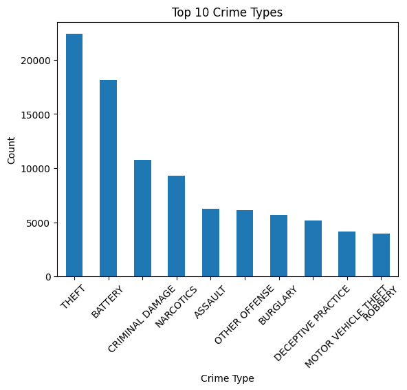
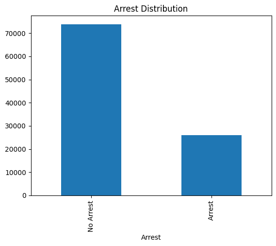
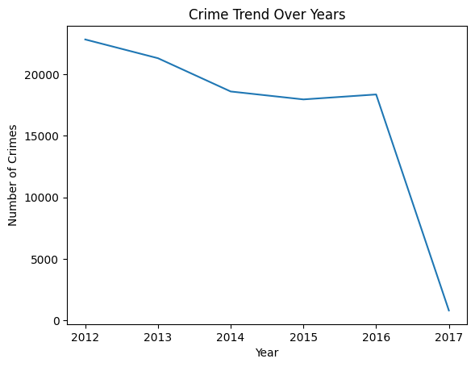
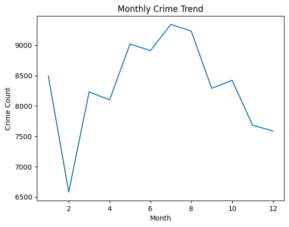
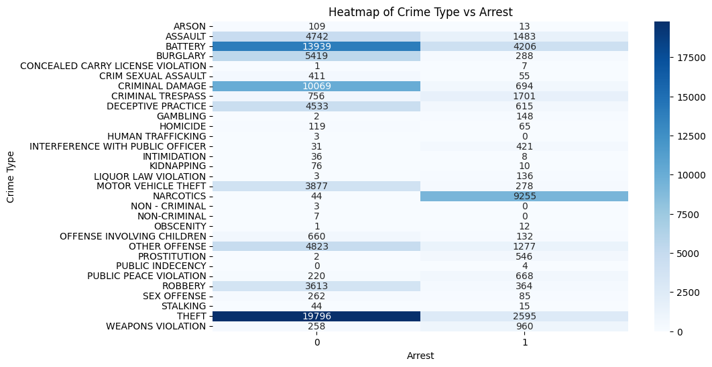
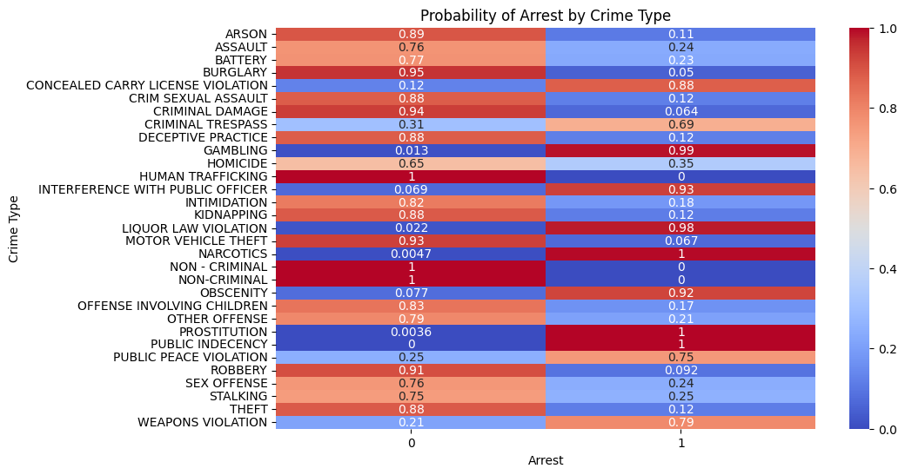
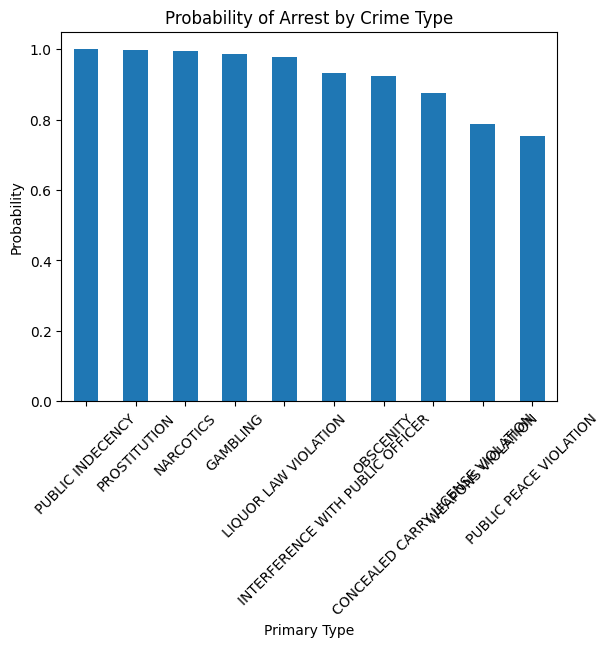

# Statistical Analysis and Modeling of Urban Crime Patterns  
### Using the Chicago Crime Dataset

> A statistical and machine learning-based analysis of urban crime patterns using real-world data.

##  Overview
This project presents a comprehensive statistical analysis of urban crime patterns using the Chicago Crime Dataset (2012–2017). The objective is to identify trends, examine relationships between crime characteristics, and model the probability of arrest using statistical and machine learning techniques.

The study applies descriptive analysis, hypothesis testing, probability estimation, and logistic regression to extract meaningful insights from large-scale real-world crime data.

## Key Results
- Logistic Regression Accuracy: **~86%**
- Significant association between crime type and arrest (p < 0.001)
- Theft & Battery are most frequent crimes
- Narcotics & Prostitution show highest arrest probability
---
## Key Topics Covered
- Exploratory Data Analysis (EDA)  
- Statistical Inference  
- Chi-Square Test of Independence  
- Probability Estimation  
- Logistic Regression  
- Feature Engineering  
- Categorical Data Analysis  
- Time Series Trend Analysis  
- Data Visualization (Matplotlib, Seaborn)  
- Predictive Modeling  


## Objectives
- Analyze temporal trends in crime using time-based features  
- Study the distribution and variability of crime types  
- Examine relationships between crime type, location, and arrest status  
- Apply chi-square hypothesis testing to identify statistical associations  
- Estimate probability of arrest across different crime categories  
- Build a logistic regression model to predict arrest outcomes  

---

##  Dataset
- 🔗 Dataset Link: https://www.kaggle.com/datasets/currie32/crimes-in-chicago
- **Source:** Chicago Police Department (CLEAR system) via Kaggle  
- **Time Period:** 2012–2017  
- **Sample Size:** 100,000 records (random sample)  
- **Key Features Used:**
  - Date  
  - Primary Type (crime category)  
  - Location Description  
  - Arrest (binary outcome)  
  - District  

---

## Methodology

### 1. Data Preprocessing
- Selected relevant columns from the dataset  
- Removed missing values  
- Converted date column to datetime format  
- Extracted time-based features (Year, Month, Day, Hour)  

### 2. Descriptive Analysis
- Frequency distribution of crime types  
- Arrest distribution analysis  
- Year-wise and month-wise trend visualization  

### 3. Hypothesis Testing
- Chi-square test of independence  
- Tested relationship between crime type and arrest outcome  

### 4. Probability Analysis
- Computed empirical probability of arrest for each crime type  

### 5. Logistic Regression Model
- One-hot encoding of categorical variables  
- Train-test split (80-20)  
- Model trained using scikit-learn  
- Evaluated using accuracy, precision, recall, and F1-score  

## Sample Visualizations

### 🔹 Top Crime Types


### 🔹 Arrest Distribution


### 🔹 Year-wise Crime Trend


### 🔹 Monthly Crime Trend


### 🔹 Heatmap (Crime vs Arrest)


### 🔹 Normalized Heatmap (Probability)


### 🔹 Probability of Arrest


---

## Results
- Theft and Battery are the most frequent crime types  
- Crime shows seasonal variation, peaking during summer months  
- Chi-square test confirms a significant relationship between crime type and arrest (p < 0.001)  
- Arrest probability varies significantly across crime types  
- Logistic regression achieved approximately **85–87% accuracy**  
- Certain crimes (e.g., Narcotics, Prostitution) show much higher arrest likelihood  

---

## Key Insights
- Crimes where offenders are caught in real-time (e.g., Narcotics) show very high arrest rates  
- Property crimes (e.g., Theft, Burglary) have significantly lower arrest probabilities  
- Crime patterns show strong seasonal trends, peaking in summer months  
- Arrest likelihood is highly dependent on crime category  

## Technologies Used
- Python  
- Pandas  
- NumPy  
- Matplotlib  
- Seaborn  
- Scikit-learn  
- SciPy  

---

## Project Structure
```
crime-trend-analysis/
│
├── crime_analysis.ipynb     # Jupyter notebook with full analysis
├── report.pdf              # Detailed project report
├── README.md               # Project documentation
├── requirements.txt        # Dependencies
```

---

## How to Run
1. Clone the repository:
   ```bash
   git clone https://github.com/helenmariaajay/crime-trend-analysis.git
   ```
2. Install dependencies:
   ```bash
   pip install -r requirements.txt
   ```
3. Open the notebook:
   ```bash
   jupyter notebook
   ```
4. Run all cells in `crime_analysis.ipynb`

---

## Future Work
- Incorporate spatial analysis using latitude/longitude  
- Apply advanced models (Random Forest, XGBoost)  
- Address class imbalance for improved prediction  
- Integrate external socio-economic data  

---

## Author
**Helen Maria Ajay**  

---
